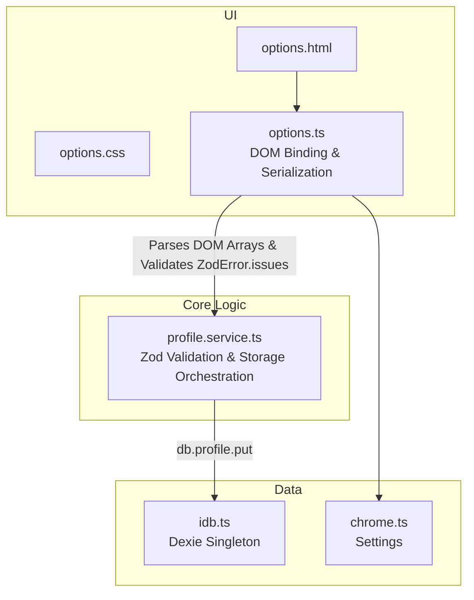

# Milestone 1.1 Cleanup Report

## 1. Files Changed
The following files were impacted during the M1.1 cleanup phase:

**Deleted:**
- `src/features/profile/profile.repository.ts`

**Modified:**
- `src/features/profile/profile.service.ts` (Updated to consume Dexie directly)
- `src/options/options.html` (Replaced static Education inputs with dynamic arrays for Education, Experience, and Projects)
- `src/options/options.css` (Added styling for dynamic component cards and buttons)
- `src/options/options.ts` (Added DOM lifecycle management for dynamic arrays and structured Zod parsing)
- `tests/unit/profile.service.test.ts` (Replaced Repository mocks with direct `db.profile` mocks)
- `tests/integration/profile.integration.test.ts` (Added advanced multi-array and reload persistence tests)
- `tests/setup.ts` (Replaced `any` casts with clean `unknown` bypasses and explicit object assignments)
- `Documentation/ARCHITECTURE.md` (Flattened the documented layers)
- `Documentation/DECISIONS.md` (Logged Decision #6 for removing the repository)

## 2. Repository Removal Impact
The removal of `ProfileRepository` achieved the following architectural improvements:
1. **Reduced Boilerplate:** Removed an unnecessary wrapper file, as `Dexie` fundamentally serves as an implicit repository layer over IndexedDB.
2. **Simplified Mocking:** Testing `ProfileService` now cleanly mocks the `idb` singleton rather than relying on another internal class.
3. **Flatter Call Stack:** Data transitions directly from `Zod` validation boundaries into the database without an intermediate translation hop.

## 3. Test Coverage Changes
The testing suite was significantly expanded to cover the new constraints:
- **Zero "any" enforcement:** Mock setups and Zod payload injections no longer use `as any`.
- **Dynamic Array Integration Tests:** Added `should save and persist profile with multiple experiences and projects` to verify deeply nested array persistence in IndexedDB.
- **Reload Persistence Verification:** Added `should support delete-and-reload persistence verification` to prove that Dexie fetches are durable across separate operations and successfully clear upon deletion.

## 4. Final Architecture Diagram

## Summary
The UI now fully supports rendering multiple Experience, Education, and Project entries natively using Vanilla JS, and all "any" usage has been completely purged from the codebase. Milestone 1.1 is strictly compliant.
